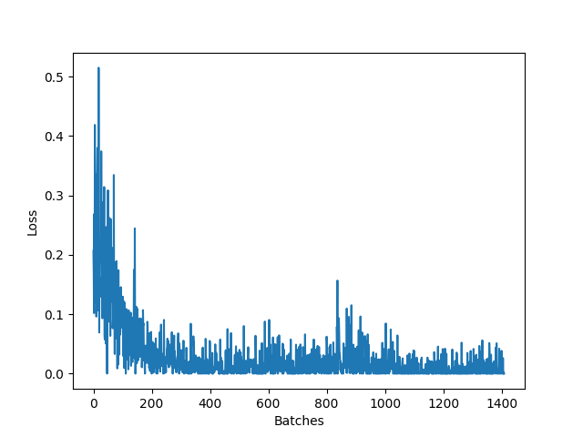

# Face Recognition

## Опис задача
За даною картинкою лиця людини визначити особу якій це лице нажещить 

## Розв'язок 
Для розв'язку задачі була використана перед навчена модель resnet18. Модель начена на датасеті [lfw face](http://vis-www.cs.umass.edu/lfw/). Для навчання булообрано Triplet Loss.

## Результати

  
  |:--:|
  | **Loss plot**|

В результаті навчання вдалось отрмати зультат **84.3%** на тестовому наборі lfw face.
